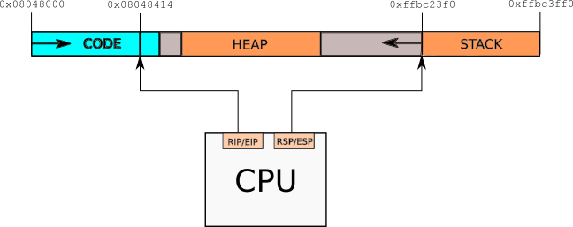

# Hacking Club Ch01 - 17th May 2017

## What is RE?

In a broad sense Reverse Engineering is the opposite process of design and development.
In electrical and mechanical engineering you get a finished product and disassemble it
into its components. The goal is to analyse it and achieve understanding how the thing is
made and how it works.

In software engineering Reverse Engineering (RE) is similar process with similar goals.
You get a piece of software (most of the time compiled with no source/documentation
available) and analyse it to grasp a certain aspect of it or every bit of logic in it.
Because most of the software is running directly on the CPU our interception point is
at the level of machine language. That is why reverse engineers must understand the
program at its lowest level - assembly language for the CPU architecture our program is
running on. Not always we are dealing with programs that directly hit the metal.
Software written in Java, dotNet or ActionScript are made to run on a middle execution
layer with its own instruction set and rules.

In summary I'll try to list what a reverse engineer must be familiar with:
* assembly and architecture of x86, ARM, MIPS processors
* executable file formats - ELF, PE, etc
* byte code and architecture of Java VM, IL(dotNet), Flash, pyc(Python), etc
* internals of popular OSes - Windows, Linux, iOS, Android
* C/C++
* little compiler theory is good to know
* Python or other script to automate boring stuff

If taking a higher perspective, RE is a sub-problem of program analysis. Rolf Rolles (a big
name in RE community) has a huge academic [reading list](http://www.msreverseengineering.com/program-analysis-reading-list/). I suggest one first get into the craft (hands on dissasembled code)
and then go deeper into the rabbit hole (academic stuff).

## What RE skills can be used for?

### Description

Activity | Description
---------|------------
CTF (Capture The Flag) | Infosec championships and challenges
Malware Analysis | The act of disecting malicious software. Usually AV companies hire skilled RE people for this kind of job
Cracking | The act of bypassing software copyrignt protections in order to steal/copy and use it for free
Vulnerability Exploitation | Writing exploits for PoC (if you are a good guy) or malware (if you are bad one)
Software Archeology | Tinkering old/undocumented/bizzare hardware/software for fun
Game Hacking | [Writing bots for fun and mostly profit](https://www.youtube.com/watch?v=hABj_mrP-no)

### Activity analysis

Activity | Target surface | Target code base | Legality | Difficulty | Target hostility | Target defense | Time
---------|----------------|------------------|----------|------------|------------------|----------------|-----
CTF | small | small | legal | vary | friendly | vary | short
Malware Analysis | small to medium | small (most of the time) | legal | vary | hostile | protected | short to medium
Cracking | small | large to huge | ilegal | medium to hard | naughty | complex code to protected | short to medium
Vulnerability Exploitation | small | large to huge | could be both | hard to insane | usually friendly | complex code | short to medium
Software Archeology | large to huge | large to huge | legal (usually) | vary | friendly | usually complex code | long term
Game Hacking | large to huge | huge | could be both | usually hard | naughty | protected | long term

## Intro to x86 architecture

### Some terminology

Term | Description
-----|------------
x86/x32 | Refers to 32 bit Intel based processor architecture
x86_64/amd64/x64 | Refers to the 64 bit extension to the x86 family introduced first by AMD

### Little endianness

The x86 architecture is little endian:

### Basic program layout

### Registers

#### General Purpose

Register x64 / x32 | Purpose | Instructions that implicitly modify/read
---------|---------|-----------------------------------------
RAX / EAX | Acumulator register. Used in arithmetic operations | mul, imul, ..
RCX / ECX | Counter register (CX). Used in shift/rotate instructions and loops | loop, rep <instr>, scasX, stosX, ..
RBX / EBX | Base register (BX). Used as a pointer to data (located in segment register DS, when in segmented mode) | ..
RDX / EDX | Data register (DX). Used in arithmetic operations and I/O operations | mul, imul, ..
R8 - R15 / (missing | Additional general purpose registers added by 64 bit extension | ..
RSP / ESP | Stack Pointer register (SP). Pointer to the top of the stack | push, pop, call, leave, ret, ..
RBP / EBP | Stack Base Pointer register (BP). Used to point to the base of the stack | leave, ..
RDI / EDI | Source Index register (SI). Used as a pointer to a source in stream operations | stosX, scasX, ..
RSI / ESI | Destination Index register (DI). Used as a pointer to a destination in stream operations | stosX, scasX, ..

NOTE: [X86 Assembly/X86 Architecture](https://en.wikibooks.org/wiki/X86_Assembly/X86_Architecture) used as reference

#### Special

Register x64 / x32 | Purpose | Instructions that implicitly modify/read
---------|---------|-----------------------------------------
RIP / EIP | Instruction pointer. Points where next instruction is in memory | call, jmp, jXX, ret, ..
RFLAGS / EFLAGS | The flag register. Most of the time we are using arithmetic flags CF, ZF, SF, OF | jXX, cmp, test, add, sub, imul, mul, ..

#### FLAGS (first 16 bits of EFLAGS / RFLAGS)

Bit | Abbr. | Description | Extra Desc. | Category
----|-------|-------------|-------------|---------
0x0 | CF | Carry Flag | Set if the last arithmetic operation carried (addition) or borrowed (subtraction) a bit beyond the size of the register. This is then checked when the operation is followed with an add-with-carry or subtract-with-borrow to deal with values too large for just one register to contain. | Status
0x1 |  | Reserved, always 1 in EFLAGS  |  |
0x2 | PF | Parity flag | Set if the number of set bits in the least significant byte is a multiple of 2. | Status
0x3 |  | Reserved |  |
0x4 | AF | Adjust flag | Carry of Binary Code Decimal (BCD) numbers arithmetic operations. | Status
0x5 |  | Reserved |  |
0x6 | ZF | Zero flag | Set if the result of an operation is Zero (0). | Status
0x7 | SF | Sign flag | Set if the result of an operation is negative. | Status
0x8 | TF | Trap flag (single step) | Set if step by step debugging. | Control
0x9 | IF | Interrupt enable flag | Set if interrupts are enabled. | Control
0xA | DF | Direction flag |  Stream direction. If set, string operations will decrement their pointer rather than incrementing it, reading memory backwards. | Control
0xB | OF | Overflow flag | Set if signed arithmetic operations result in a value too large for the register to contain. | Status
0xC - 0xD | IOPL | I/O privilege level |  I/O Privilege Level of the current process, (286+ only), always 1 on 8086 and 186 | System
0xE | NT | Nested task flag | Controls chaining of interrupts. Set if the current process is linked to the next process, (286+ only), always 1 on 8086 and 186. | System
0xF |  | Reserved, always 1 on 8086 and 186, always 0 on later models |  |

## Short illustration

See my solution of [locky](https://github.com/mr6r4y/re-write-ups/tree/master/crackmes/YUBITSecCTF_locker/solution)

# What's Next?
1. Intro to x86 (continue)
    1. Instructions
    1. Calling conventions
1. Intro to Radare2 toolset
    1. rabin2
    1. radare2 (r2) basic commands
1. Inspect common code patterns
    1. Simple main()
    1. Functions
    1. If-else
    1. Loops
1. [IOLI Crackmes](https://github.com/mr6r4y/re-write-ups/tree/master/crackmes/r2-wshp-2015)