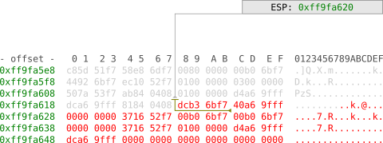

# Hacking Club Ch01 - 23th May 2017

## Hacking as code

Before getting down with technical details I'll point out some principals to follow during
our hacking sessions. These are not rules but good practices that will keep our knowledge
base in shape:

* Every analysis we do (excercise solution or solving a crackme) should end up with an analysis
script - either `.r2` radare script, `.py` python script or both, and should be put in github.
* When we generalize the things we often do as part of our work - make external tools and scripts
* Any change in the environment we use (installation of tools, etc.) should be backed up with
Ansible playbook/script. Currently I maintain a repository in github for Ansible playbooks
that try to do that
* Write articles in `.md` format (if script with comments are not efficient) and put them in
github repository also

That way when we stand up against a new challenge without our home laptop, we can build up
and use everything we know in a matter of minutes whereever we are.

## Tools Introduction

### Radare2

This is the open source RE swiss army knife. It is a hex-editor, disassembler and debugger
all in one tool. It is multiplatform and it is very light weight in comparison with other
tools. I push this tool to be used during our sessions for these reasons:

* it is open source - this means you can contribute to it, inspect it and start into the field of RE without sacrificing a pile of money
* you can automate work with it in several different ways - it has also several scripting language bindings (Python included)
* it maintains many architectures and file formats

Unfortunatelly there are also a few drawbacks. It has steep learning curve and needs time
to become proficient using it. It is also a command line tool (I consider this a positive
thing) in its core. In summary I can do an analogy - this is the Vim for RE (and I know
that most of us would prefer the Eclipse for RE).

Pros | Cons
-----|-----
Open source | Sometimes they break `master` and it is very annoying
Maintains large number of architectures and formats | Steep learning curve
It is a command line tool | It is a command line tool
You can run it anywhere - Linux, OSX, Windows |
It is light-weight |
Script automation |

#### References

URL | Description
----|-------------
https://github.com/radare/radare2/blob/master/doc/intro.md | Cheatsheet describing most of the commands
https://radare.gitbooks.io/radare2book/content/ | Official Radare2 book. It is usefull as introduction tutorial
https://monosource.gitbooks.io/radare2-explorations/content/ | Another good resource that has good examples
http://radare.today/ | Radare's blog
http://www.radare.org/r/ | Official site

### IDAPro

This is the Eclipse equivalent for RE.

The difference with Eclipse is that this tool
costs a pile of money (around 2000 euro if you want the decompiler included). It is the
de-facto standard utility for the InfoSec/RE community. It is fancy with nice UI and
advanced analysis for multiple architectures (if you pay for license cause the free
version can open only PE for 32 bit applications). It has many plugins (which are free of charge)
and has SDK that one can use to extend the tool. I can say many nice things about this tool
but I'll stop and make several points why we are **NOT** going to use it.

#### Why we are NOT going to use IDAPro

##### The price

The price limits the tool to be used only by established professionals that earn enough
in the InfoSec industry. If an individual just starts into the field this is a huge barier.
I'm not considering piracy at all:

* it is not an ethical option
* even if you get the tool you cannot access community resources, SDK and all the other stuff
that makes IDAPro significant
* if you are serious with a carreer in InfoSec, that could costs you to be listed on IDAPro's
wall of shame and be unable to get license forever

##### Closed source

All the know-how in this tool is locked. Although reversing IDAPro is a very good excercise in
RE (I think the license permits reversing the tool) the source is closed with all its cons.

##### It makes you lazy at learning

By using not so shiny tools you inevitably hit issues with analysis and learn how the tool
operates. You are forced to:

* understand the executable file format in more details
* understand how the tool operates and how analysis is done
* extend and fix the tool in different areas
* not using a decompiler and be proficient in reading assembly

Ovarall you learn how to do more with less and at the end develop deeper understanding.

I will use analogy with Eclipse - I know Java programmers that left without their magical IDE
cannot write "Hello world" program that compiles.

#### References

URL | Description
----|-------------
https://www.hex-rays.com/products/ida/ | Official site
[The IDA Pro Book 2nd edition](https://www.amazon.co.uk/IDA-Pro-Book-Unofficial-Disassembler/dp/1593272898/) | Good book on the subject

### OllyDbg

OllyDbg is a free application debugger running on Windows written for the purpose of RE. It has many nice features.
It is very fun to use and was the leading tool from the pre-64bit windows era. If you open a random video
with cracking tutorials on the internet, probably the tool in action is Olly. Unfortunatelly, it only can run
32 bit windows applications and the tool is not maintained. There is a nice projects that is filling the gap - [x64dbg](http://x64dbg.com/#start).

I mention it as history reference. OllyDbg is Windows specific debugger and cannot operate with anything else than
PE for 32 bit.

#### References

URL | Description
----|------------
[x64dbg](http://x64dbg.com/#start) | The OllyDbg ancestor for 64 bit windows applications
http://www.ollydbg.de/ | Official site

## Intro to x86 architecture (continue)

### Assembly Syntax

Currently there are two syntaxes for x86 assemby in use - Intel syntax and AT&T syntax.
Linux tools (such as `gcc`, `as` - the assembler under gcc) usually implement AT&T syntax.
Most of the RE tools use Intel syntax and a lot of tools maintain both. For now we will
discuss only Intel syntax and later introduce AT&T.

#### Intel Syntax

The main format of an assembly instructions is:

```nasm
instr dest, src
```

where `instr` is the mnemonic used as described in any reference (for example `mov`, `add`, etc),
`dest` is the destination operand and `src` is the source operand. For example:

```nasm
mov eax, edx
```

will move the content from `edx` in `eax` register.

In x86 there are instructions that also accept zero, one or three operands:

```nasm
instr
instr arg
instr dest, src, aux
```

Examples:

```nasm
popad
inc eax
imul esi, edi, 25
```

I will point out another syntactic structure used. In Radare2 disassembly you will come accross:

```nasm
instr dest, byte/word/dword/qword [src]
instr byte/word/dword/qword [dest], src
```
which means:

> Use what is between `[` and `]` as address value and take `byte`/`word`/`dword`/`qword` from that memory address

The lengths of `byte`/`word`/`dword`/`qword` are:

Name | Length
-----|-------
byte | 1 byte = 8 bits
word | 2 bytes = 16 bits
dword (double word) | 4 bytes = 32 bits
qword (quadratic word) | 8 bytes = 64 bits

Examples:

```nasm
; Move a dword from local variable at memory pointed by `ebp-0x34` to `eax` register
add eax, dword [ebp-0x34]
```

```nasm
; Add the local variable at memory pointed by `ebp-0x34` with `eax` and then store it back at memory `ebp-0x34`
add dword [ebp-0x34], eax
```
The story of memory offsets in assembly and disassemly for x86 is not complete with this description.
In practice however and at the current level of our understanding it is more than enough to know.
When we talk about processor's running modes and memory models, we will come back and add segment
registers to the pointer arithmetic mix. For now you must know that the memory model in use is *flat* and
things are simple.

### Basic instructions

#### Data transfer

##### [mov](http://www.felixcloutier.com/x86/MOV.html)

The most basic instruction that moves something from `src` to `dest`. `src` can be register or
memory location and `dest` is either immediate value, register or memory location. Mind that you cannot
use `mov` to do memory-to-memory move and you have to use a temporary register instead:


```nasm
; Register to register - `edx` to `eax`
mov eax, edx
```

```nasm
; Memory to register - Local variable at memory on the stack to `eax`
mov eax, dword [rbp-0x34]
```

```nasm
; Register to memory - `eax` to local variable on the stack
mov dword [rbp-0x24], eax
```

```nasm
; Immediate value to register - `edx` now is -2 (two's complement)
mov edx, 0xfffffffe
```

```nasm
; Immediate value to memory - local variable at memory on the stack now is -2 (two's complement)
mov dword [rbp-0x24], 0xfffffffe
```

Other frequently used variants are:

* [movzx](http://www.felixcloutier.com/x86/MOVZX.html) - zero extend
* [movsx](http://www.felixcloutier.com/x86/MOVSX:MOVSXD.html) -  sign extend

##### [rep](http://www.felixcloutier.com/x86/REP:REPE:REPZ:REPNE:REPNZ.html) prefix

Some instruction allow using the `rep`(REPeat) prfeix. The semantics of this is to
repeat the same instruction until `ecx` register is decremented to 0. The instructions 
allowed to have `rep` prefix are the string instructions (instructions that use `esi` as 
source and `edi` as destination implicitly) - `movs`, `lods`, `stos`, etc.

##### [movs[b/w/d/q]](http://www.felixcloutier.com/x86/MOVS:MOVSB:MOVSW:MOVSD:MOVSQ.html)

Used to move data memory-to-memory. The `[b/w/d/q]` suffixes represent size of 
data to operate on - byte, word, dword, qword. The source memory address is
pointed by `rsi`/`esi` and the destination is pointed by `rdi`/`edi`.
The two registers must be initialiased before using `movs[b/w/d/q]`. After the execution,
values in `esi` and `edi` are incremented (or decremented if the direction flag (`DF` in `EFLAGS`)
is set):

```nasm
; ...

mov ecx, 6            ; Set `ecx`. It is the counter for the `rep` prefixed instruction
mov esi, 0x10090f58   ; Set source for `movsd`
mov edi, 0x10090f60   ; Set destination for `movsd`

; ...

; `movs[b/w/d/q]` instruction is a single byte op code with no operands.
; You can see it with added implicit operands of destination and source
; for convenience, by the RE tools.
;
;   rep movsd dword es:[edi], dword ptr [esi]
;   movsd dword es:[edi], dword ptr [esi]
;
rep movsd   ; (6 + 1) * 4 = 0x1c bytes copied. 
movsd       ; `esi` and `edi` are incremented with 0x1c and `ecx` is 0.
```

Usually this is seen in inline implementations of `memcpy()`.

##### [lea](http://www.felixcloutier.com/x86/LEA.html)

Computes the effective address of the second operand (the source operand) and stores it in the 
first operand (destination operand). What this means in practice is:

```nasm
lea eax, [ebp-0x4]  ; Equivalent to:   mov eax, ebp
                    ;                  sub eax, 4
                    ;
                    ; or:              eax = ebp - 4
```

The `lea` instruction is handy for such arithmetic tricks.

##### [push](http://www.felixcloutier.com/x86/PUSH.html) and [pop](http://www.felixcloutier.com/x86/POP.html)

Used for stack operations. `push` puts something on the stack and `pop` takes out the object on top and
put it in the register pointed by the operand. 

In x86 the stack is represented by the memory
pointed by `rsp`/`esp`. So `push` decrements the value of `esp` (remember that stacks in x86 grows downwards)
and copies the value pointed by its operand on `[esp]`.

`pop` does just the opposite - increments `esi` and copies `[esi]` to the object pointed by `pop`'s operand.



```nasm
push 0x3   ; Put 0x3 dword on the stack
; equivalent to:  sub esp, 0x4
;                 mov [esp], 0x3 
```


```nasm
pop eax    ; Pops 0x3 dword into `eax`
; equivalent to:  mov eax, [esp]
;                 add esp, 0x4
```


#### Control flow

In x86, control flow is indicated by `rip`/`eip` register. However, you cannot modify `eip` directly
with `mov` or trying any arithmetic - `add eip, 0xa` is illegal for example.

There are a couple of special instructions that can manipulate `eip` indirectly.

##### [jmp](http://www.felixcloutier.com/x86/JMP.html)

##### [jcc](http://www.felixcloutier.com/x86/Jcc.html)

##### [call](http://www.felixcloutier.com/x86/CALL.html)

##### [ret](http://www.felixcloutier.com/x86/RET.html)

##### [nop](http://www.felixcloutier.com/x86/NOP.html)

`nop` stands for No OPeration. It just does nothing. It is like a `inc eip` if it was legal.
Its opcode is `0x90` and it is good to know to visually detect areas filled with it.

#### Comparison

##### [cmp](http://www.felixcloutier.com/x86/CMP.html)

##### [test](http://www.felixcloutier.com/x86/TEST.html)

#### Arithmetic

Most arithmetic instructions are straight forwarward:

* [add](http://www.felixcloutier.com/x86/ADD.html) - Addition
* [sub](http://www.felixcloutier.com/x86/SUB.html) - Substraction
* [neg](http://www.felixcloutier.com/x86/NEG.html) - Two's complement negation (turn 2 to -2)
* [inc](http://www.felixcloutier.com/x86/INC.html) - Increment by 1
* [dec](http://www.felixcloutier.com/x86/DEC.html) - Decrement by 1
 
##### [mul](http://www.felixcloutier.com/x86/MUL.html) and [imul](http://www.felixcloutier.com/x86/IMUL.html)

`mul`/`imul` is unsigned/signed multiplication.

##### [div](http://www.felixcloutier.com/x86/DIV.html) and [idiv](http://www.felixcloutier.com/x86/IDIV.html)

`div`/`idiv` is unsigned/signed division.

#### Logical

Logical instructions are straight forward:

* [and](http://www.felixcloutier.com/x86/AND.html) - logical AND
* [or](http://www.felixcloutier.com/x86/OR.html) - logical OR
* [not](http://www.felixcloutier.com/x86/NOT.html) -  logical NOT (0xff into 0x00)

##### [xor](http://www.felixcloutier.com/x86/XOR.html)

The special attention to `xor` is not because of some peculiarity in the instruction. The Exclusive OR 
itself is special in a way. In cryptography the `xor` is used at the core of any encryption mechanism.
That is because of the function properties of its domain and range (in mathematical terms). So when
you encounter frequent `xor` usage, mind that you probably are looking at encryption/decryption code. 

#### Shift and rotate

* [shr](http://www.felixcloutier.com/x86/SAL:SAR:SHL:SHR.html)
* [shl](http://www.felixcloutier.com/x86/SAL:SAR:SHL:SHR.html)

#### Other

##### [int 0x80](http://www.felixcloutier.com/x86/INT%20n:INTO:INT%203.html) and [sysenter](http://www.felixcloutier.com/x86/SYSENTER.html)

##### [std](http://www.felixcloutier.com/x86/STD.html) and [cld](http://www.felixcloutier.com/x86/CLD.html)

### Interrupts and exceptions

### Privilage levels (Rings)

#### CPU modes of operation

#### Syscalls