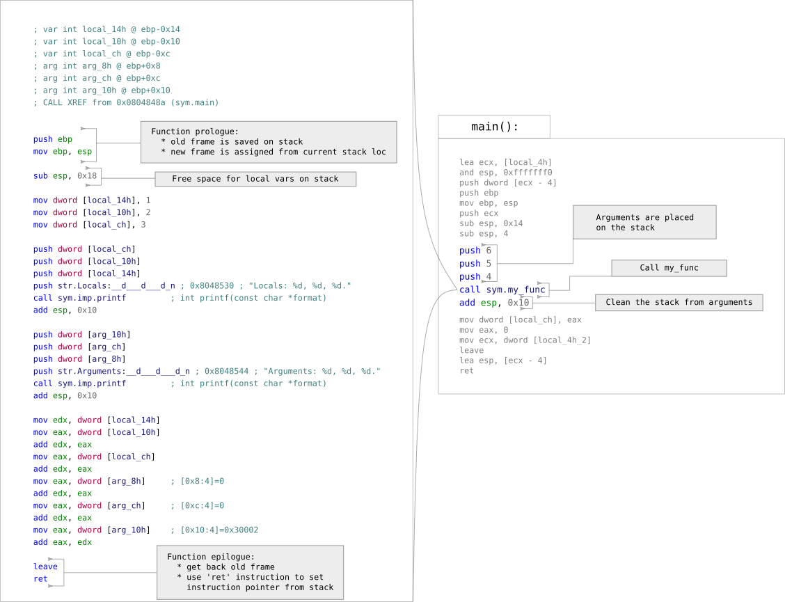

# Hacking Club Ch01 - 2nd June 2017

## Basic Radare2 navigation

### Lets start

We open an executable in Radare2 with the following command:
```bash
r2 ./executable
```

If we need to make fixes or patches, we need 'write' permissions:
```bash
r2 -w ./executable
```
and the `-w` option is used.

For opening a session in the standard debugger (which is GDB in Linux):
```bash
r2 -d ./executable
```

For starting Radare2 and executing a script right after our file is loaded:
```bash
r2 -i ./radare_script.r2 ./executable
```

### Navigation

You are dropped at the `entry0` flag, which is the program entrypoint
described by a field in the executable format:

```
[0x08048310]>
```

The address between `[` and `]` is our current location in the file or memory.
In Radare2 this is our main navigation using the command line interface. Most of
the commands we execute implicitly take our current location.

When we are dealing with executable files (ELF, PE, MachO, etc), Radare2 is
kind enough to represent the space and addresses we can reach as if the file is
loaded in memory for execution. That is why we can see the file itself starting
from offset `[0x00000000]>`, but also we see the same file mapped to `[0x08048000]>`
(this is the standard memory address at which ELF32 is loaded into its process memory).

We can change our current location with `s` command. The parameter can be an address
or a `flag`:

```
[0x08048310]> s 0x08048000
[0x08048000]> s main
[0x08048470]>
```

### Help

Whenever in doubt about how to use a command - type `?` or command's first character and `?`:

```
[0x08048470]> ?
Usage: [.][times][cmd][~grep][@[@iter]addr!size][|>pipe] ; ...
Append '?' to any char command to get detailed help
Prefix with number to repeat command N times (f.ex: 3x)
|%var =valueAlias for 'env' command
| *[?] off[=[0x]value]    Pointer read/write data/values (see ?v, wx, wv)
| (macro arg0 arg1)       Manage scripting macros

...

| ?@?                     Misc help for '@' (seek), '~' (grep) (see ~??)
| ?:?                     List and manage core plugins
[0x08048470]> s?
|Usage: s  # Seek commands
| s                 Print current address
| s:pad             Print current address with N padded zeros (defaults to 8)

...

| sr pc             Seek to register
| ss                Seek silently (without adding an entry to the seek history)
[0x08048470]>
```

### Analysis

`a` is the "analysis" command. Usually `aaa` is used for full analysis:

```
[0x08048310]> aaa
[x] Analyze all flags starting with sym. and entry0 (aa)
[x] Analyze len bytes of instructions for references (aar)
[x] Analyze function calls (aac)
[ ] [*] Use -AA or aaaa to perform additional experimental analysis.
[x] Constructing a function name for fcn.* and sym.func.* functions (aan))
[0x08048310]>
```

### Printing

`p` is used to print stuff around. By using `x` form you can print hexadecimal
representation of regions:

```
[0x08048470]> px @ 0x0
- offset -   0 1  2 3  4 5  6 7  8 9  A B  C D  E F  0123456789ABCDEF
0x00000000  7f45 4c46 0101 0100 0000 0000 0000 0000  .ELF............
0x00000010  0200 0300 0100 0000 1083 0408 3400 0000  ............4...
0x00000020  f817 0000 0000 0000 3400 2000 0900 2800  ........4. ...(.
0x00000030  1f00 1c00 0600 0000 3400 0000 3480 0408  ........4...4...
0x00000040  3480 0408 2001 0000 2001 0000 0500 0000  4... ... .......
0x00000050  0400 0000 0300 0000 5401 0000 5481 0408  ........T...T...
0x00000060  5481 0408 1300 0000 1300 0000 0400 0000  T...............
0x00000070  0100 0000 0100 0000 0000 0000 0080 0408  ................
0x00000080  0080 0408 7c06 0000 7c06 0000 0500 0000  ....|...|.......
0x00000090  0010 0000 0100 0000 080f 0000 089f 0408  ................
0x000000a0  089f 0408 1401 0000 1801 0000 0600 0000  ................
0x000000b0  0010 0000 0200 0000 140f 0000 149f 0408  ................
0x000000c0  149f 0408 e800 0000 e800 0000 0600 0000  ................
0x000000d0  0400 0000 0400 0000 6801 0000 6881 0408  ........h...h...
0x000000e0  6881 0408 4400 0000 4400 0000 0400 0000  h...D...D.......
0x000000f0  0400 0000 50e5 7464 5c05 0000 5c85 0408  ....P.td\...\...
[0x08048470]>
```

Or we can print disassembly of code we want to analyse by `pd?` form:

```
[0x08048310]> s main
[0x08048470]> pdf
            ;-- main:
/ (fcn) sym.main 50
|   sym.main ();
|           ; var int local_ch @ ebp-0xc
|           ; var int local_4h_2 @ ebp-0x4
|           ; var int local_4h @ esp+0x4
|              ; DATA XREF from 0x08048327 (entry0)
|           0x08048470      8d4c2404       lea ecx, [local_4h]
|           0x08048474      83e4f0         and esp, 0xfffffff0
|           0x08048477      ff71fc         push dword [ecx - 4]
|           0x0804847a      55             push ebp
|           0x0804847b      89e5           mov ebp, esp
|           0x0804847d      51             push ecx
|           0x0804847e      83ec14         sub esp, 0x14
|           0x08048481      83ec04         sub esp, 4
|           0x08048484      6a06           push 6
|           0x08048486      6a05           push 5
|           0x08048488      6a04           push 4
|           0x0804848a      e87cffffff     call sym.my_func
|           0x0804848f      83c410         add esp, 0x10
|           0x08048492      8945f4         mov dword [local_ch], eax
|           0x08048495      b800000000     mov eax, 0
|           0x0804849a      8b4dfc         mov ecx, dword [local_4h_2]
|           0x0804849d      c9             leave
|           0x0804849e      8d61fc         lea esp, [ecx - 4]
\           0x080484a1      c3             ret
[0x08048470]>
```

The `@` (at) is used to point to different location then the current one.
`d` in the command stands for "disassemble" and `f` for "function".
`pdf` works after analysis phase, otherwise there is no function found.
Using only `pd` (using number-of-instructions as argument) or `pD` 
(using number-of-bytes as argument) disassembles data where you point it.

## Calling functions

Lets see what is going under the hood when a function is called in a C program.
The sample we use is [func_call.c](samples/func_call.c). In order to track easily
the program flow, numbers 1 to 3 are assigned to local variables and 4 to 6 are
passed as arguments to `my_func()`.

For illustration how scripting is used I have prepared a
script to use for analysis of this program.

Compile the samples using:

```bash
cd eCm-hclub/ch01/samples
make
```

Then you can execute [func_call_static.r2](samples/func_call_static.r2):

```bash
r2 -i ./func_call_static.r2 ./func_call_x86
```

### First impressions

Lets take a look at the assembly:



There are several interesting things to notice:

* arguments to functions are pushed on the stack in opposite order
* stack is cleaned from arguments after each function `call`
* a function has a *prologue* and an *epilogue*
* function's local variables are on the stack and space is reserved for them

The `leave` instruction does just the opposite of the *prologue*.
`leave` is equivalent to:

```nasm
mov esp, ebp
pop ebp
```

which is called a function *epilogue*.

The names of `local_?h` and `arg_?h` in instructions:

```nasm
; ...
mov dword [local_14h], 1
mov dword [local_10h], 2
mov dword [local_ch], 3
; ...
mov eax, dword [arg_8h]     ; [0x8:4]=0
add edx, eax
mov eax, dword [arg_ch]     ; [0xc:4]=0
add edx, eax
mov eax, dword [arg_10h]    ; [0x10:4]=0x30002
; ...
```

are placed by our analysis tools. You can see what their meaning is from
the comment also placed by analysis:

```nasm
; var int local_14h @ ebp-0x14
; var int local_10h @ ebp-0x10
; var int local_ch @ ebp-0xc
; arg int arg_8h @ ebp+0x8
; arg int arg_ch @ ebp+0xc
; arg int arg_10h @ ebp+0x10
```
So what we see is after the function *prologue* we have a starting point
saved in the frame register (`ebp`). Forward we have our local variables
(stack grows backwards so *forward* is `ebp-0x??`) and backwards we see 
the function's arguments (`ebp+0x??`). That is the main mechanism used
by most compilers to deal with functions/procedures in higher languages.

What is very important to have in our minds is the pattern of memory on the 
stack at that moment.

### Dynamic look


## Function calling conventions

TO-DO ..